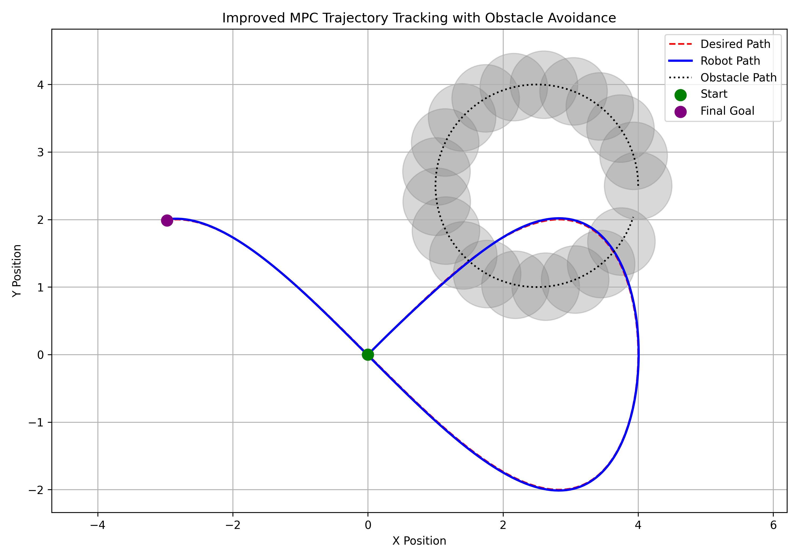

# MPC-Based Trajectory Tracking with Dynamic Obstacle Avoidance

This project simulates a robot using **Model Predictive Control (MPC)** to track a dynamic trajectory (e.g. a moving goal or patrol route) while actively avoiding a moving obstacle in real time.

##  Tools Used
- Python
- NumPy
- SciPy (SLSQP optimization)
- Matplotlib

##  Key Features
- Model Predictive Control (MPC) for motion planning
- Trajectory tracking with dynamic replanning
- Dynamic obstacle avoidance using cost penalization
- Real-time velocity and acceleration constraints

##  Result



##  How to Run
```bash
python mpc_trajectory_avoidance_sim.py
